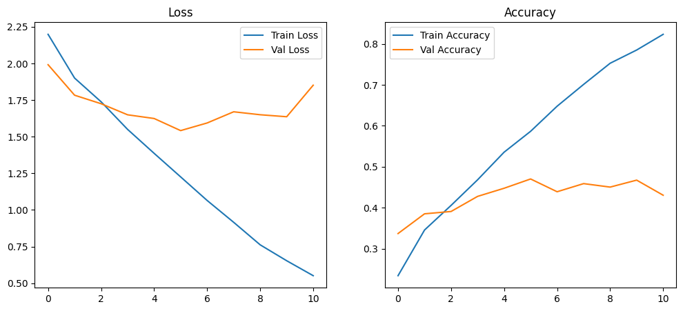
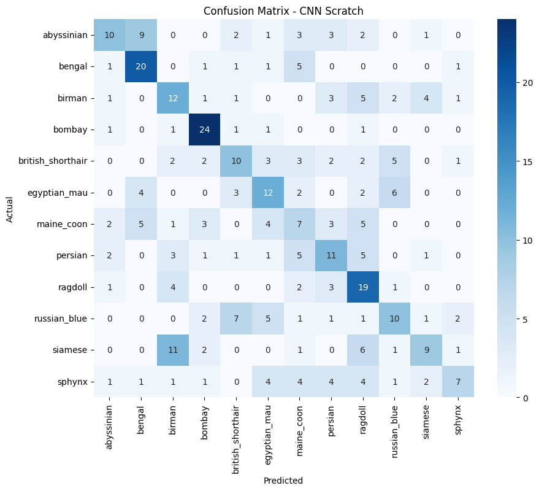
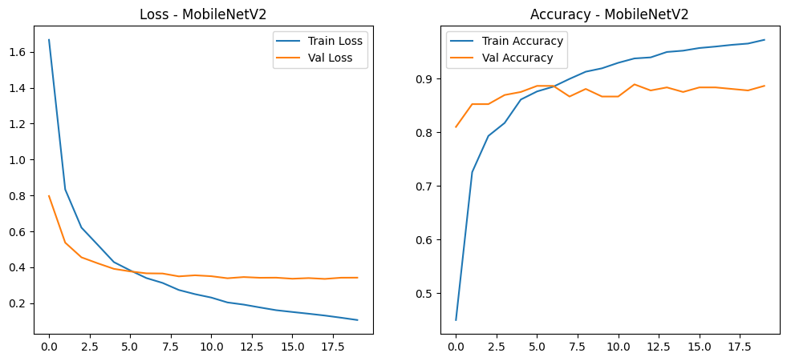
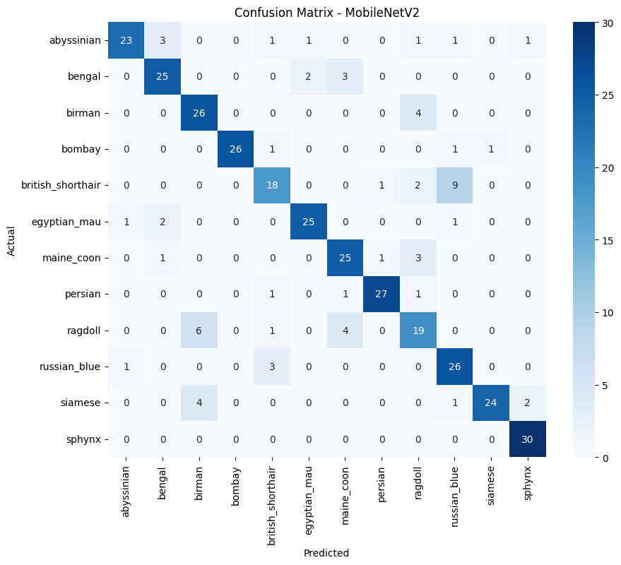
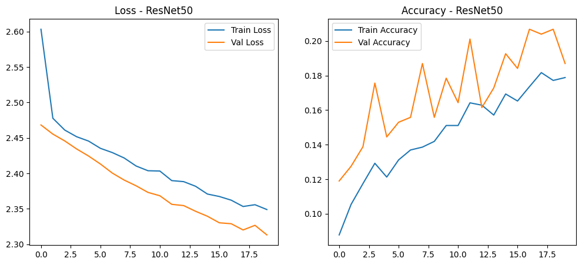
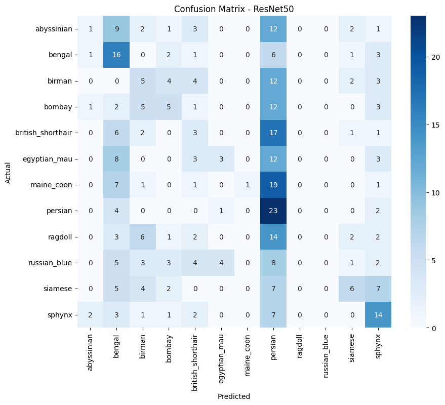

# 🐱 Cat Breed Classification

## 📌 Deskripsi Proyek
Proyek ini bertujuan untuk membangun sistem **klasifikasi ras kucing** berbasis **Deep Learning** menggunakan data citra.  
Sistem mampu mengklasifikasikan gambar kucing ke dalam **12 ras kucing** dengan membandingkan performa:

1. **CNN Scratch (Non-Pretrained)** sebagai baseline  
2. **MobileNetV2 (Transfer Learning)**  
3. **ResNet50 (Transfer Learning)**  

Selain pelatihan model, proyek ini dilengkapi dengan **dashboard berbasis Streamlit** yang memungkinkan pengguna melakukan prediksi ras kucing secara interaktif melalui website.

---

## 📂 Dataset

### Sumber Dataset
Dataset yang digunakan adalah **Oxford-IIIT Pet Dataset**, yang tersedia secara publik dan umum digunakan dalam penelitian klasifikasi citra hewan.

🔗 https://www.robots.ox.ac.uk/~vgg/data/pets/

### Deskripsi Dataset
- Total kelas: **12 ras kucing**
- Format data: **Citra (JPG)**
- Resolusi bervariasi
- Variasi pose, pencahayaan, dan skala

## 🐾 Contoh Ras Kucing

<table>
  <tr>
    <td align="center">
      <br>
      <b>Abyssinian</b>
    </td>
    <td align="center">
      <br>
      <b>Bengal</b>
    </td>
    <td align="center">
      <br>
      <b>Birman</b>
    </td>
    <td align="center">
      <br>
      <b>Bombay</b>
    </td>
  </tr>
  <tr>
    <td align="center">
      <br>
      <b>British Shorthair</b>
    </td>
    <td align="center">
      <br>
      <b>Egyptian Mau</b>
    </td>
    <td align="center">
      <br>
      <b>Maine Coon</b>
    </td>
    <td align="center">
      <br>
      <b>Persian</b>
    </td>
  </tr>
  <tr>
    <td align="center">
      <br>
      <b>Ragdoll</b>
    </td>
    <td align="center">
      <br>
      <b>Russian Blue</b>
    </td>
    <td align="center">
      <br>
      <b>Siamese</b>
    </td>
    <td align="center">
      <br>
      <b>Sphynx</b>
    </td>
  </tr>
</table>

### Jumlah Data
Dataset diperluas menggunakan **augmentasi data** untuk memenuhi ketentuan minimal:
- **Training** : 6.632 gambar  
- **Validation** : 353 gambar  
- **Testing** : 360 gambar  

Total data > **7.300 citra**

---

## 🔧 Preprocessing Data
Tahapan preprocessing yang dilakukan:
1. Resize gambar ke ukuran `224 x 224`
2. Normalisasi nilai pixel (0–1)
3. Data augmentation pada data training:
   - Horizontal Flip
   - Rotation
   - Zoom
   - Width & Height Shift

Preprocessing bertujuan untuk meningkatkan kemampuan generalisasi model dan mengurangi overfitting.

---

## 🧠 Model yang Digunakan

### 1️⃣ CNN Scratch (Baseline)
Model Convolutional Neural Network yang dibangun dari awal tanpa pretrained weights dan digunakan sebagai pembanding dasar**.

**Karakteristik:**
- Digunakan sebagai baseline
- Arsitektur sederhana
- Mengalami overfitting, karena keterbatasan data dan tidak adanya pengetahuan awal (pretrained features)

---

### 2️⃣ MobileNetV2 (Transfer Learning)
Model MobileNetV2 pretrained yang diadaptasi menggunakan pendekatan transfer learning.

**Keunggulan:**
- Ringan dan efisien
- Waktu training lebih cepat
- Model paling stabil dan optimal pada eksperimen

---

### 3️⃣ ResNet50 (Transfer Learning)
Model deep residual network dengan 50 layer yang dirancang untuk ekstraksi fitur kompleks.

**Keunggulan:**
- Arsitektur sangat dalam dan kompleks
- Secara teori mampu mengekstraksi fitur tingkat tinggi
- Namun pada eksperimen ini menghasilkan akurasi sangat rendah (21%)
- Diduga disebabkan oleh:
-- Kompleksitas model yang tidak sebanding dengan ukuran dataset
-- Fine-tuning yang belum optimal
-- Model gagal melakukan generalisasi dan cenderung overfitting

---

## 📊 Evaluasi dan Analisis

Evaluasi dilakukan menggunakan data testing dengan metrik:
- Accuracy
- Precision
- Recall
- F1-score
- Confusion Matrix
- Grafik Loss dan Accuracy

### 📊 Ringkasan Hasil

| Model | Accuracy | Analisis |
|------|----------|----------|
| CNN Scratch | 42% | Baseline, mengalami overfitting |
| MobileNetV2 | 82% | Performa terbaik dan stabil |
| ResNet50 | 21% | Model terlalu kompleks, fine-tuning kurang optimal |

**Kesimpulan:**  
Model dengan pendekatan **MobileNetV2** memberikan peningkatan performa yang signifikan dibandingkan CNN yang dilatih dari awal.

---
### 📈 Visualisasi Performa Model

Untuk memperkuat analisis hasil klasifikasi, dilakukan visualisasi performa masing-masing model menggunakan **plot accuracy–loss** serta **confusion matrix**. Visualisasi ini bertujuan untuk memberikan gambaran perilaku pelatihan model serta kemampuan klasifikasi pada data uji.

---

#### 1️⃣ CNN Scratch

**Plot Accuracy & Loss**



Grafik menunjukkan perbedaan yang cukup signifikan antara nilai accuracy dan loss pada data training dan validation. Hal ini mengindikasikan bahwa model CNN Scratch mengalami **overfitting**, di mana model mampu mempelajari data training dengan baik namun kurang mampu melakukan generalisasi pada data baru.

**Confusion Matrix**



Confusion matrix menunjukkan bahwa model masih sering melakukan kesalahan klasifikasi antar kelas. Prediksi tidak dominan pada diagonal utama, yang menandakan kemampuan ekstraksi fitur masih terbatas.

---

#### 2️⃣ MobileNetV2

**Plot Accuracy & Loss**



Kurva training dan validation pada MobileNetV2 terlihat relatif stabil dan saling mendekati. Hal ini menunjukkan bahwa model memiliki kemampuan **generalization** yang baik serta proses pelatihan yang lebih optimal dibandingkan model lainnya.

**Confusion Matrix**



Sebagian besar hasil prediksi berada pada diagonal utama confusion matrix, yang menandakan tingkat akurasi klasifikasi yang tinggi dan konsisten pada setiap kelas.

---

#### 3️⃣ ResNet50

**Plot Accuracy & Loss**



Grafik menunjukkan nilai accuracy yang rendah baik pada data training maupun validation. Hal ini mengindikasikan bahwa proses **fine-tuning ResNet50 belum optimal**, serta kompleksitas model tidak sebanding dengan jumlah dan karakteristik data yang digunakan.

**Confusion Matrix**



Confusion matrix memperlihatkan distribusi prediksi yang kurang merata pada diagonal utama. Model sering salah dalam membedakan kelas, sehingga performa keseluruhan menjadi rendah.

---

### 🧠 Pembahasan Visualisasi

Berdasarkan hasil visualisasi plot dan confusion matrix, dapat disimpulkan bahwa **MobileNetV2** memberikan performa terbaik dan paling stabil. Model ini mampu menyeimbangkan kompleksitas arsitektur dengan kemampuan generalisasi data.  
Sebaliknya, CNN Scratch mengalami overfitting, sedangkan ResNet50 menunjukkan performa yang rendah akibat kompleksitas model yang terlalu tinggi dan proses fine-tuning yang kurang optimal.

---

## 🌐 Dashboard Website
Aplikasi web dikembangkan menggunakan **Streamlit** dengan fitur:
- Pemilihan model klasifikasi
- Upload gambar kucing
- Prediksi ras kucing
- Confidence score
- Tabel probabilitas seluruh kelas

---

## ▶️ Cara Menjalankan Aplikasi Secara Lokal

### 1️⃣ Clone Repository
```bash
git clone https://github.com/username/cat-breed-classification.git
cd cat-breed-classification
```
### 2️⃣ Buat Virtual Environment
```bash
python -m venv venv
venv\Scripts\activate
```
### 3️⃣ Install Dependencies
```bash
pip install -r requirements.txt
```
### 4️⃣ Jalankan Aplikasi Streamlit
```bash
streamlit run dashboard/app.py
```
## 📁 Struktur Folder

```
cat-breed-classification/
│
├── dashboard/
│   └── app.py
│
├── models/
│   ├── cnn_scratch_cat_breed_final.keras
│   ├── mobilenetv2_cat_breed_final.keras
│   └── resnet50_cat_breed_final.keras
│
├── sample_images/
│   ├── abyssinian.jpg
│   ├── bengal.jpg
│   └── ...
│
├── labels.txt
├── requirements.txt
└── README.md

```
